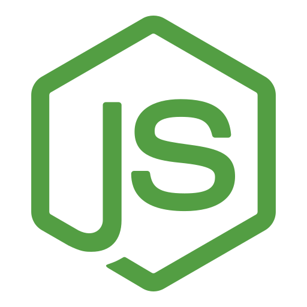
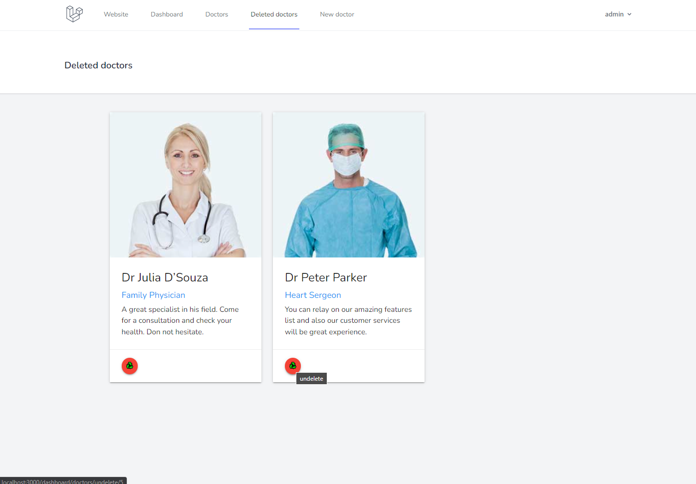

    <h1>Clinic Laravel MVC</h1>
    <h3>
        <a href="#quickstart">
            Quickstart
        </a>
         | 
        <a href="https://github.com/chrisonoo/ClinicLaravelMVC">
            GitHub
        </a>
    </h3>
    
App for Clinic. Managing doctors, patients, and visits.

    
<b>Status:</b> Project completed

     
    
Technologies and tools:

    

        
        
        
        
        
        
        
        
        
         
        
        
        
        
        
        
        
        
        
    

     
    

        
         
        
        
        
         
        
        
        
    

 

## Description

This is a clinic management application that I've developed to practice various programming patterns and reinforce my knowledge. The app allows users to add doctors and patients to the database and to schedule appointments. It's designed using the MVC pattern, the Code First approach, and the MariaDB database. Please note that it doesn't encompass all functionalities typical for a clinic management system. Its main purpose is to showcase my coding skills, understanding of programming concepts, and coding style.

## Realized functions

1. Complete installation documentation you can find in the README.md file (you are reading it).
2. Migration and seeders with sample data.
3. Web Application with content for users not logged in and logged in.
4. Search by Name, Surname, and Specialization in one field.
5. Validation in editing and adding a new doctor using Laravel (Required field and appropriate text length).
6. Implementation of CRUD operations to the database for logged-in users.
7. The delete operation from the database does not delete the data. It only toggles the flag in the is_active field.
8. Recycle bin to restore deleted doctors.

## Features under development

1. Design based on [Materialize CSS](https://materializecss.com), better responsive.
2. Admin Panel for the system administrator.
3. List of patients, doctors' duty hours, and appointments.
4. Possibility to upload profile photos.
5. Project better integration with Webpack. All files in the `public` folder are to be created by Webpack.
6. More complicated database queries (foreign key tables).
7. Log all operations to the database.
8. Test implementation.
9. Implementation of automatic documentation.
10. Live version based on Nginx + private VPS.
11. Move the application to Docker.

## Quickstart

Make this procedure for launching the project locally after downloading the project from GitHub.

1. We issue commands in the terminal in the project folder.
2. `composer self-update` - update composer if there is a newer version.
3. `composer install` - install all needed packages from composer.json. The composer will create a vendor folder with all packages.
4. `composer update` - update all installed packages.
5. Configure of `charset` and` collation` in the file `configdatabase.php`.
6. Replace the file name `.env.example` with` .env`.
7. `php artisan key: generate` - generate a unique application key. It will save the key in the `.env` file.
8. `Database connection configuration`. In the `.env` file, item `DB_DATABASE = `give the name of the database and possibly configure other parameters such as IP, PORT, USER, and PASSWORD.
9. `Create an empty database` with the name specified in step `8.` and the collation specified in step `5.` collation.
10. `php artisan migrate` - run the migration. The command will create [1] an array with data, [2] an array with information about migrations, [3] an array with personal tokens.
11. `php artisan db: seed` - upload test data to the database.

After migrations and seeders, one predefined user will appear in the database. Of course, you can also create your user. 

**User:** admin@admin.pl  
**Password:** admin123

> ATTENTION!  
> Go through the following steps so that Webpack can generate up-to-date `*.js` and `*.cs` files.

## AUTOMATIC PAGE REFRESHING IN THE BROWSER

1. `npm install` - install the node packages from the package.json file. We need them in further configuration. This command will create the node_modules folder will be created with all packages.
2. `mix.browserSync('127.0.0.1:8000');` - add webpack.mix.js to the end of the file, the entry is responsible for the Laravel and Webpack server configuration.
3. `php artisan serve` - start the artisan server first.
4. `npm run watch` - open a second terminal window and run the command. Both commands you should run at the same time in separate terminal windows.

## JS and CSS, WEBPACK COMPILATION

1. `materialize.js` is compiled to app.js using Webpack. Configuration details in `resources\js\app.js`.
2. `materialize.css` is compiled into app.css using Webpack. Configuration details in `resources\css\app.css`.
3. `validator.js` is compiled to validator.js using Webpack.
4. The Webpack configuration is in the `wepack.mix.js` file.

## MVC

Below is the visualization of the MVC model implemented in the application.

    

## About Me

Hello, I'm Krzysztof, but feel free to call me Chris. I'm a budding full-stack programmer with a special focus on **.NET** and **SQL**. Passionate about problem-solving, I enjoy crafting efficient **backend** and **frontend** solutions.

As an emerging software developer, I'm keen to apply my knowledge and skills in a professional setting. I'm excited to bring my life and professional experience, providing a unique perspective to software development tasks. Eager to commence my journey in the industry, I am **actively seeking employment opportunities** where I can continue to grow and create.

Check out my [Portfolio](https://onoo.no/portfolio) or connect with me on [LinkedIn](https://www.linkedin.com/in/k-p-z/).

[
 
](https://onoo.no/portfolio)
